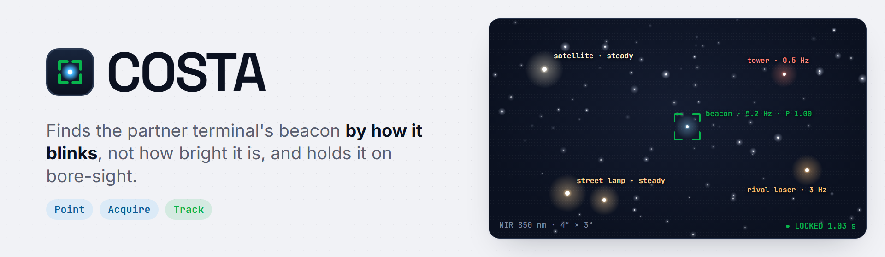
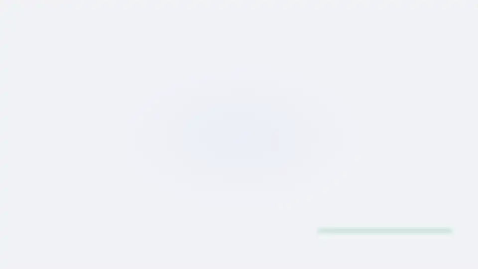
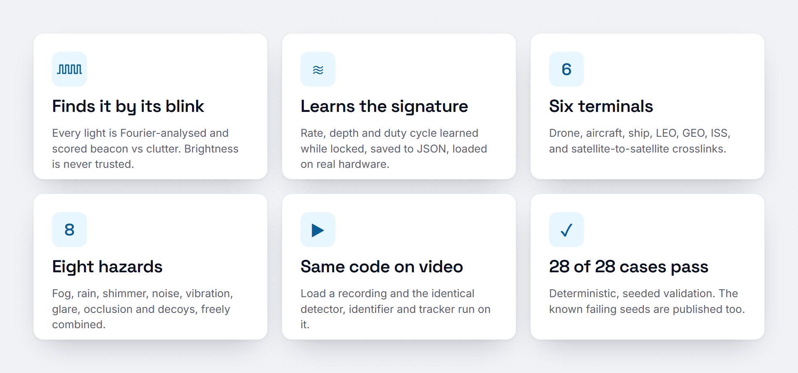
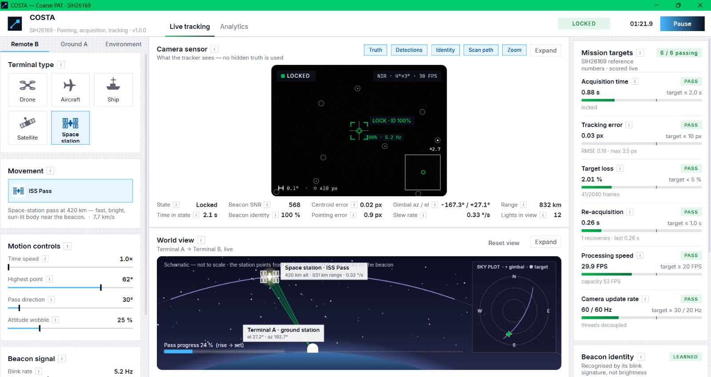
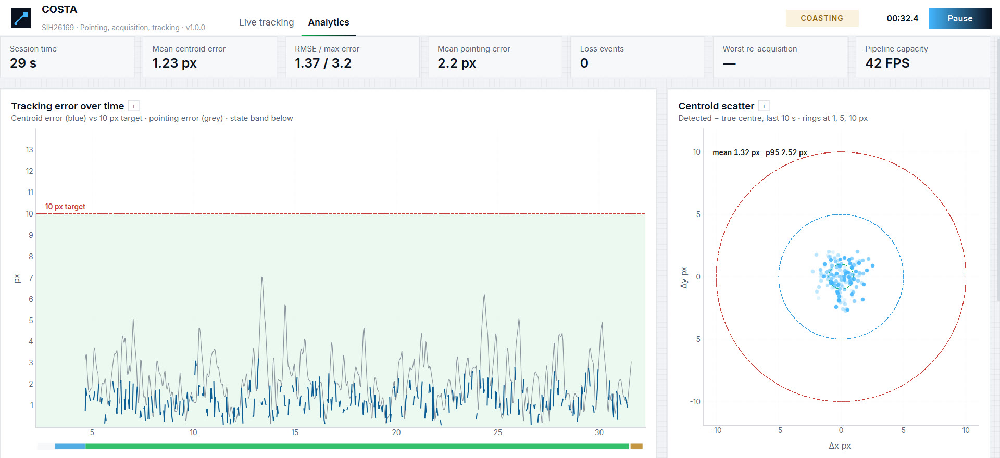
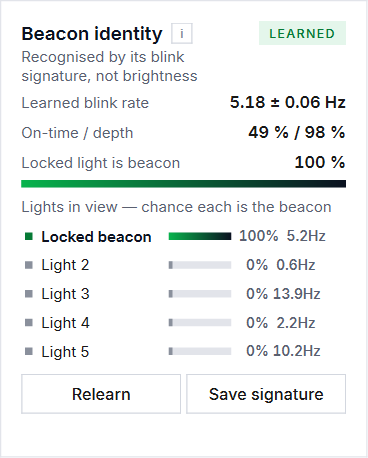
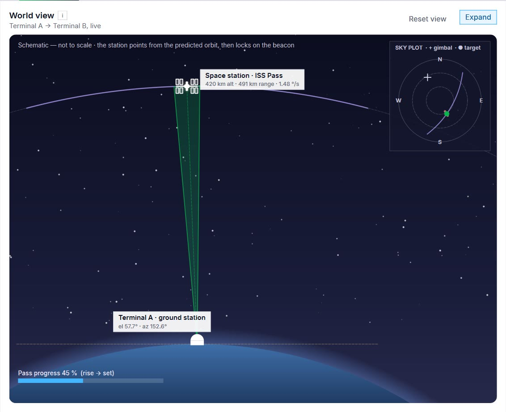
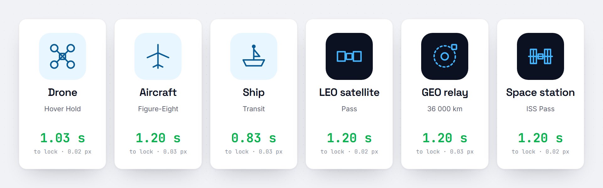
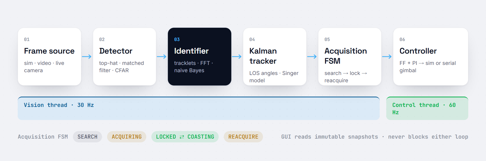

<a id="top"></a>

<p align="center">
  
</p>

<p align="center">
  
  
  
  
  
  
</p>

<h1 align="center">COSTA</h1>
<p align="center"><b>Coarse Optical Tracking &amp; Alignment System</b></p>

<p align="center">
  <b>Coarse pointing, acquisition and tracking for a free-space optical link.</b><br>
  It finds the partner terminal's beacon among stars, street lights and decoys by <i>how it blinks</i>, not how bright it is,<br>
  and drives a pan/tilt gimbal to keep it on bore-sight, locking in about a second.
</p>

<p align="center">
  <a href="#quick-start"><b>Quick start</b></a> ·
  <a href="#how-it-works"><b>How it works</b></a> ·
  <a href="#verify-it-yourself"><b>Verify it yourself</b></a> ·
  <a href="#beacon-identification"><b>Why not the brightest light</b></a> ·
  <a href="docs/assets/demo.mp4"><b>Watch the demo</b></a>
</p>

<br>

<p align="center">
  
</p>
<p align="center">
  <sub>COSTA in under a minute.</sub>
</p>

<br>

<p align="center">
  
</p>
<p align="center">
  <sub>LEO pass through a dense star field: pre-pointed from the ephemeris, the beacon picked out by its blink, locked in 1.2 s and held to within about 2 px. Shown at 2× speed.</sub>
</p>

<details>
<summary><b>Table of contents</b></summary>

- [Why it matters](#why-it-matters)
- [Every target, met](#every-target-met)
- [Features](#features)
- [Gallery](#gallery)
- [Any terminal, any sky](#any-terminal-any-sky)
- [Beacon identification](#beacon-identification)
- [How it works](#how-it-works)
- [Quick start](#quick-start)
- [Verify it yourself](#verify-it-yourself)
- [Real footage](#real-footage)
- [Hardware](#hardware)
- [FAQ](#faq)
- [Project layout](#project-layout)
- [Built with](#built-with)

</details>

## Why it matters

A free-space optical link carries data on a laser beam narrower than a football pitch at a
kilometre. Before a single bit can flow, each terminal has to find the other's beacon in a
4° × 3° camera view and keep it centred while both ends move. At range the beacon can be fainter
than a street lamp, a star or a sun-lit spacecraft, so "track the brightest light" fails the moment
the sky gets busy. **COSTA** recognises the beacon by its learned blink signature,
confirms it with geometry, and hands a smooth pointing reference to the gimbal, whether the partner
is a drone, a ship, an aircraft, a LEO satellite, a GEO relay or the space station.

## Every target, met

| SIH26169 asks for | The tracker delivers |
|---|---|
| Acquisition time ≤ 2 s | **0.83–1.60 s** cold start to confirmed lock, across all 28 cases |
| Tracking error ≤ 10 px | **0.02–3.28 px** mean centroid error while locked |
| Target loss < 5 % | **2.89–4.98 %**, including a deliberate 2.4 s beacon blockage in every run |
| Re-acquisition ≤ 1 s | **0.13–0.97 s**, worst case scored |
| Processing speed ≥ 20 FPS | 30 Hz vision loop, capacity shown live |
| Camera update ≥ 30 Hz render / ≥ 20 Hz control | 60 Hz GUI, 60 Hz gimbal control, on separate threads |

Ground truth is used **only by the evaluator**. The detector, identifier, tracker and controller never
see it. The live **Mission targets** panel scores all six with PASS / FAIL as you watch.

## Features

<p align="center">
  
</p>

- **Finds the beacon, not the brightest light.** Every light gets a track and a brightness history;
  its blink is Fourier-analysed and scored beacon-vs-clutter. Stars, tower lights, strobes, glints and
  even a second laser blinking at a different rate are rejected.
- **Learns the signature, then carries it.** While locked it learns the real rate, depth and duty
  cycle. *Save signature* writes it to JSON so a video or hardware session starts already knowing its
  beacon.
- **Six terminals, one tracking core.** Drone, aircraft, ship, LEO satellite, GEO relay and ISS pass,
  plus satellite-to-satellite crosslinks. Drag the remote terminal in the world view and it flies there.
- **Eight physical hazards.** Fog, rain, heat shimmer, sensor noise, mount vibration, sun glare,
  occlusion and decoy lights, freely combined from 0 to 100 %.
- **Same code on real footage.** Load a recorded clip and the identical detector, identifier, Kalman
  tracker and controller run on it. Click a light to seed the lock by hand.
- **Drives real hardware.** A two-servo pan/tilt head on an Arduino, over a simple serial protocol.
- **Scored honestly.** 28 deterministic validation cases, and the known failing seeds are published,
  not hidden.

<p align="right"><a href="#top">Back to top ↑</a></p>

## Gallery

<table>
  <tr>
    <td width="50%"></td>
    <td width="50%"></td>
  </tr>
  <tr>
    <td><sub><b>Live tracking.</b> Camera sensor with identity labels and lock brackets, the world view, and the six mission targets.</sub></td>
    <td><sub><b>Analytics.</b> Error timeline with state band, centroid bullseye, loop rates and the per-stage latency budget.</sub></td>
  </tr>
  <tr>
    <td></td>
    <td></td>
  </tr>
  <tr>
    <td><sub><b>Beacon identity.</b> The learned rate and duty, and a beacon probability for every light in view.</sub></td>
    <td><sub><b>Space.</b> Orbit schematic with pass progress and a sky plot. The camera's field of view is drawn as a wedge.</sub></td>
  </tr>
</table>

## Any terminal, any sky

<p align="center">
  
</p>

| Terminal | Patterns | What makes it hard |
|---|---|---|
| Drone | Hover Hold · Zig-Zag Evasive · Spiral Approach · Random Manoeuvre · Manual Drive | ~1 g weaving, range 3 km ↔ 0.9 km |
| Aircraft | Linear Flyby · Circular Orbit · Figure-Eight · Manual Drive | Cannot hover; high line-of-sight rates |
| Ship | Maritime Sway · Ship Transit · Manual Drive | Mast-top beacon rolling and pitching in a sea state |
| Satellite | LEO Pass · GEO Relay | Ephemeris-cued (σ 0.5°), 0.1–1 °/s LOS rates, drifting stars |
| Space station | ISS Pass | A bright sun-lit body right beside the beacon, hardest at dusk |

Ground terminal A can be a fixed pier, a vehicle, a ship deck, or **a satellite on its own LEO orbit**,
for a genuine two-satellite crosslink. Every change blends in smoothly; nothing jumps.

## Beacon identification


**Blink, don't shine.** Operational links key their beacons, so this tracker does what they do and
learns the key instead of being told it:

1. **Tracklets.** Every light is associated frame to frame in line-of-sight angles, with gimbal motion
   compensated.
2. **Forced photometry.** Brightness is measured at every track even when the detector did not fire, so
   an OFF phase reads as *dark*, not *missing*.
3. **Features.** Dominant frequency, periodicity, modulation depth and duty cycle from an FFT of the
   history.
4. **Naive-Bayes likelihood ratio.** Before learning, only generic knowledge: a beacon is keyed, roughly
   symmetric, faster than natural flicker. While locked, the beacon model learns the real signature and
   the clutter model learns everything else. A steady star is never learned as the beacon.
5. **Fusion with geometry.** Acquisition needs cue consistency, rate consistency *and* identity. A
   passing light cannot steal the lock just by coming close.

<br clear="right">

<p align="right"><a href="#top">Back to top ↑</a></p>

## How it works

<p align="center">
  
</p>

```
 FrameSource ─► BeaconDetector ─► BeaconIdentifier ─► LOS Kalman tracker ─► Acquisition FSM ─► GimbalController ─► Gimbal
 sim / video /  top-hat, matched   tracklets, FFT      Singer model,         SEARCH → ACQUIRING →  FF + PI, 60 Hz     sim / serial
 live camera    filter, CFAR       signature, learning Mahalanobis gating    LOCKED ⇄ COASTING → REACQUIRE
```

1. **Detection** finds every point light: white top-hat, Gaussian matched filter and a MAD-based CFAR
   threshold that follows the real noise floor of any camera, plus a ½ and ¼ pyramid for large beacons.
   No training data.
2. **Identification** scores each light as beacon or clutter from its blink signature (above).
3. **Tracking** runs a Kalman filter in line-of-sight angles with a Singer manoeuvring-target model, so
   it is independent of the camera's own motion.
4. **Acquisition** follows the standard FSOC PAT procedure: a GPS-cued Archimedean spiral for aircraft
   and ships; ephemeris pre-pointing and a stare for spacecraft, as in NASA's OPALS.
5. **Control** combines velocity feed-forward from the Kalman rate with PI feedback, rate- and
   acceleration-limited, at 60 Hz.

Vision runs at 30 Hz and control at 60 Hz on separate threads. The GUI reads immutable snapshots and
never blocks either loop.

## Quick start

```bash
dist\COSTA.exe                              # the app, no Python needed
```

```bash
python -m pip install -r requirements.txt
python main.py                               # run from source
python tools/make_demo_video.py              # realistic test clips + ground-truth CSVs
powershell -ExecutionPolicy Bypass -File build_exe.ps1   # rebuild the .exe
```

Pick a terminal in **Remote B**, a mount in **Ground A**, add hazards in **Environment**, and watch the
six targets on the right. Logs (per-frame CSV and a JSON summary) and the saved beacon signature are
written to `logs\`.

## Verify it yourself

Every headline number is reproducible with one command and a fixed seed:

```bash
python benchmark.py                          # all 28 cases, 40 s each, seed 42
python benchmark.py --duration 20 --only leo,decoys
```

```text
  Drone · Hover Hold                      1.03 s   0.02 px   2.91 %   0.17 s   PASS
  Satellite · LEO Pass                    1.20 s   0.02 px   3.35 %   0.33 s   PASS
  Satellite · GEO Relay                   1.20 s   0.03 px   4.98 %   0.97 s   PASS
  Dim beacon · bright blinking decoys     1.03 s   0.04 px   2.91 %   0.17 s   PASS
  Storm (fog+rain+shimmer+vibration+occ)  1.60 s   2.19 px   3.04 %   0.20 s   PASS
  ...
  28 of 28 cases pass all six targets
```

<details>
<summary><b>All 28 cases</b></summary>
<br>

| Case | Acquisition | Tracking error | Target loss | Worst re-acq | Result |
|---|---|---|---|---|---|
| Drone · Hover Hold | 1.03 s | 0.02 px | 2.91 % | 0.17 s | PASS |
| Aircraft · Linear Flyby | 1.23 s | 0.03 px | 2.92 % | 0.17 s | PASS |
| Aircraft · Circular Orbit | 1.23 s | 0.04 px | 2.92 % | 0.17 s | PASS |
| Aircraft · Figure-Eight | 1.20 s | 0.03 px | 2.92 % | 0.17 s | PASS |
| Drone · Zig-Zag Evasive | 1.03 s | 0.03 px | 2.91 % | 0.17 s | PASS |
| Drone · Spiral Approach | 1.03 s | 0.04 px | 2.91 % | 0.17 s | PASS |
| Ship · Maritime Sway | 1.20 s | 0.03 px | 2.92 % | 0.17 s | PASS |
| Ship · Transit | 0.83 s | 0.03 px | 2.89 % | 0.17 s | PASS |
| Drone · Random Manoeuvre | 1.03 s | 0.03 px | 2.91 % | 0.17 s | PASS |
| Satellite · LEO Pass | 1.20 s | 0.02 px | 3.35 % | 0.33 s | PASS |
| Satellite · GEO Relay | 1.20 s | 0.03 px | 4.98 % | 0.97 s | PASS |
| Space station · ISS Pass | 1.20 s | 0.02 px | 3.35 % | 0.33 s | PASS |
| Fog 80 % | 1.23 s | 0.09 px | 3.01 % | 0.20 s | PASS |
| Rain 80 % | 1.23 s | 0.05 px | 2.92 % | 0.17 s | PASS |
| Heat Shimmer 80 % | 1.20 s | 3.28 px | 2.92 % | 0.17 s | PASS |
| Sensor Noise 80 % | 1.03 s | 0.09 px | 2.91 % | 0.17 s | PASS |
| Mount Vibration 80 % | 1.23 s | 0.03 px | 3.44 % | 0.37 s | PASS |
| Sun Glare 80 % | 1.23 s | 0.04 px | 2.92 % | 0.17 s | PASS |
| Occlusion 80 % | 1.03 s | 0.03 px | 4.53 % | 0.13 s | PASS |
| Decoy Lights 80 % | 1.23 s | 0.04 px | 2.92 % | 0.17 s | PASS |
| Dim beacon · bright blinking decoys | 1.03 s | 0.04 px | 2.91 % | 0.17 s | PASS |
| Night · Decoys + Noise | 1.43 s | 0.07 px | 3.37 % | 0.33 s | PASS |
| LEO pass · dense satellites + shimmer | 1.20 s | 2.04 px | 3.35 % | 0.33 s | PASS |
| ISS pass at dusk · sun-lit body | 1.10 s | 0.03 px | 3.08 % | 0.27 s | PASS |
| Vehicle-mounted terminal A | 1.20 s | 0.03 px | 2.92 % | 0.17 s | PASS |
| Ship-to-ship · deck mount | 0.83 s | 1.64 px | 2.89 % | 0.17 s | PASS |
| Fast aircraft · 2× speed | 1.40 s | 0.04 px | 2.93 % | 0.17 s | PASS |
| Storm (fog+rain+shimmer+vibration+occlusion) | 1.60 s | 2.19 px | 3.04 % | 0.20 s | PASS |

About 2.4 % of every loss figure is the injected blockage.

**Known limits (seed 7):** 25 of 28 pass. Mount Vibration (11.8 % loss), Night · Decoys + Noise (lock
taken by a decoy after the blockage) and ISS pass at dusk (2.9 s acquisition) fail, and the live panel
reports them as FAIL.

</details>

<p align="right"><a href="#top">Back to top ↑</a></p>

## Real footage

Simulation is where the tracker is tuned; a recording is where it has to hold up. **Environment → Input
source → Load video…** runs the identical pipeline on any `.mp4`, `.avi`, `.mov` or `.mkv`.

| Clip (1280×720, with ground truth) | Acquisition | Tracking error | Target loss | On target vs truth |
|---|---|---|---|---|
| Day · drone, 5 Hz beacon | 0.79 s | 0.93 px | 0.00 % | 100.0 % |
| Day · sun glare + lens flare | 0.80 s | 1.06 px | 0.00 % | 100.0 % |
| Night · city lights + rival blinker | 0.76 s | 0.96 px | 0.00 % | 100.0 % |
| Steady beacon, click-seeded | 0.76 s | 1.15 px | 0.30 % | 97.3 % |
| Tiny, far, 8 Hz beacon | 0.76 s | 1.12 px | 0.00 % | 100.0 % |

On real recordings with HUD text, watermarks, star bursts and glitch bands, scale-space detection,
size-aware photometry and scene-relative saliency keep the lock on the true beacon 94–100 % of the time.
One smoke-and-fast-pan clip is **not** solved: it passes all six KPIs while holding the wrong light,
which is exactly why an independent truth check is reported alongside them.

## Hardware

Only the frame source and the gimbal change; `TrackingPipeline` and `GimbalController` are reused as-is.

```python
from fsoc.core import TrackingPipeline
from fsoc.io import VideoFileSource

src = VideoFileSource("benchmark.mp4", hfov_deg=4.0)         # or LiveCameraSource(0, my_gimbal)
pipe = TrackingPipeline(src.intrinsics)
pipe.cfg.require_cue = False
pipe.identifier.load_signature("logs/beacon_signature.json")
while (frame := src.read()) is not None:
    out = pipe.process_frame(frame)
```

The reference head is two SG90 servos on an Arduino Uno or Nano (`firmware/fsoc_pantilt`), driven at
115200 baud with one ASCII line per command (`A <pan> <tilt>`). The PC does all trajectory shaping; the
sketch slew-limits every move so no glitch can slam the head across its travel.
`python tools/hw_check.py` checks the rig.

## FAQ

<details>
<summary><b>Why not just track the brightest light?</b></summary>
<br>
At range the beacon can be fainter than a street lamp, a star or a sun-lit spacecraft. Brightness is
the one property the partner terminal does not control; its blink rhythm is.
</details>

<details>
<summary><b>Why not YOLO?</b></summary>
<br>
A beacon is not a semantic object. It is a few pixels across and defined by how it blinks and moves.
There is no labelled footage to train on, and a deep-learning runtime would bloat a 107 MB executable.
Motion segmentation (MOG2) was tried and measured worse, so it is kept off by default.
</details>

<details>
<summary><b>Does it need training data?</b></summary>
<br>
No. The detector threshold follows the camera's own noise floor and the beacon signature is learned
on the fly while locked.
</details>

<details>
<summary><b>What if two lights blink?</b></summary>
<br>
The identifier learns the real beacon's frequency, depth and duty cycle and rejects a rival blinking at
a different rate. For a genuinely ambiguous clip, click the target in the camera view.
</details>

<details>
<summary><b>Can I reproduce the numbers?</b></summary>
<br>
Yes. <code>python benchmark.py</code> replays all 28 cases with seed 42. Ground truth is only ever seen
by the evaluator.
</details>

## Project layout

| Path | What it is |
|---|---|
| `main.py` · `benchmark.py` | Application entry point · headless validation CLI |
| `fsoc/core/` | Detector, identifier, tracker, pipeline, controller, geometry. Never sees ground truth |
| `fsoc/io/` | Frame sources (video, live camera) and gimbals (simulated, static, serial) |
| `fsoc/sim/` | NIR sensor renderer, terminals, orbits, star catalogue, hazards |
| `fsoc/runtime/` | Threaded engine, SIH evaluator, recorder, validation suite |
| `ui/` | PySide6 interface: Live tracking and Analytics, light and dark themes |
| `firmware/fsoc_pantilt/` | Arduino pan/tilt sketch |
| `tools/` | Demo-clip generator, hardware check |
| `video/` | Remotion sources for the intro, launch and pitch videos |

## Built with

<p>
  
  
  
  
  
  
  
</p>

Typeface: Inter (SIL Open Font License). Acquisition procedure after NASA's OPALS demonstration.

<p align="center"><sub>Built for SIH26169 · AI-based virtual camera tracking for coarse alignment of mobile FSOC terminals</sub></p>
<p align="right"><a href="#top">Back to top ↑</a></p>
